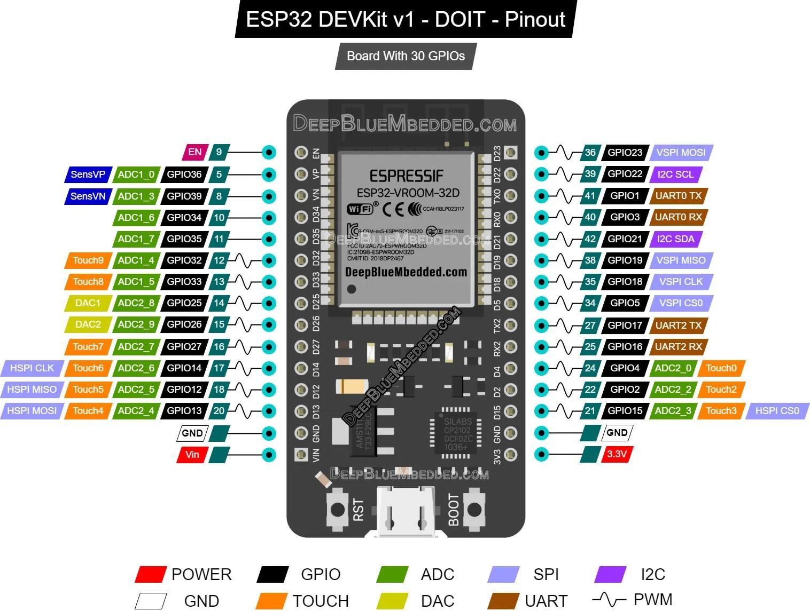

# esp32_lum

Meten van de lichtsterkte in een algen reactorvat. Naarmate de algengroei vordert, vermindert de licht doorlaatbaarheid van het reactorvat. Op een bepaald punt
is de algenkweek klaar en moet het reactorvat opnieuw gevuld worden. De lichtsterkte metingen worden geupload naar het ThingSpeak IoT platform.
Daar worden ze gemonitored en een email wordt verstuurd wanneer de kweek klaar is.   

## Hardware

#### DOIT ESP32 V1 Microcontroller

#### BH1750 licht sensor

## Bedrading
ESP32 Pin|DH1750 Pin
:--:|:--:|
|3V3||VCC|
|GND||GND|
|D22|SCL|
|D21|SDA|
|D5*|GND*|
*Debug ON

## MicroPython software

#### [code](sourcecode/micropython/esp32_lum.py)
#### [config](sourcecode/micropython/config.py)
#### [BH1750 bibliotheek](sourcecode/micropython/bh1750.py)

## ThingSpeak IoT platform

De sensor metingen worden upgeload naar het ThingSpeak IoT platform.
