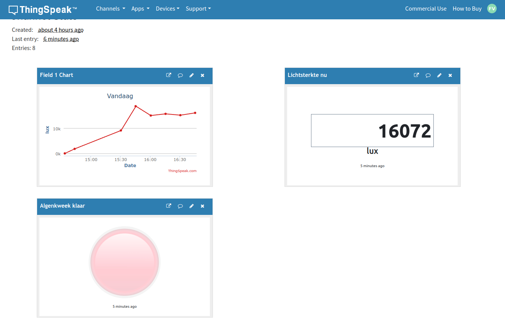

# esp32_lum

Meten van de lichtsterkte in een algenkweek reactor. Naarmate de algengroei vordert, vermindert de licht doorlaatbaarheid. Op een bepaald punt is de algenkweek klaar en moet het reactorvat opnieuw gevuld worden. De lichtsensor metingen worden geupload naar het ThingSpeak IoT platform.
Daar worden ze gemonitored en een email wordt verstuurd wanneer de kweek klaar is.   
  
## Hardware

#### Wemos ESP32-S2 Mini Microcontroller

[datasheet](resources/esp32-s2_datasheet_en.pdf)

#### BH1750 licht sensor

[datasheet](resources/Rohm-BH1750FVI-TR-datasheet.pdf)

## Bedrading

ESP32 Pin|DH1750 Pin
:--:|:--:|
|3V3|VCC|
|GND|GND|
|GPIO9|SCL|
|GPIO8|SDA|

## Behuizing

#### [STL behuizing box](case/lichtmeter_box.stl)
#### [STL behuizing top](case/lichtmeter_top.stl)
#### 
#### 
#### 
#### 
## MicroPython software

#### [code](sourcecode/micropython/esp32_lum.py)
#### [config](sourcecode/micropython/config.py)
#### [BH1750 bibliotheek](sourcecode/micropython/bh1750.py)

## ThingSpeak IoT platform

De sensor metingen worden upgeload naar het ThingSpeak IoT platform.

